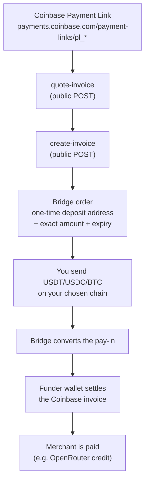

# rozo-checkout

[English](README.md) | [简体中文](README.zh.md) | [日本語](README.ja.md) | **Español**

**[Inicio rápido →](QUICKSTART.es.md)** — pagar un enlace en cinco minutos, sin leer todo esto.

```bash
npx @rozoai/checkout pay <coinbase-link> --with usdt-solana
```

Pagar un **enlace de pago de Coinbase (Coinbase Payment Link) de OpenRouter** con
una moneda que ese enlace no puede aceptar directamente: BTC por Lightning, o
USDT/USDC en Solana, BNB Chain, Ethereum, Polygon, Base o Stellar.

Un enlace de pago de Coinbase solo acepta USDC en Base. Este repositorio es una
habilidad de agente (agent skill) —más los scripts de Node que la respaldan— que
enruta cualquiera de las monedas anteriores a través de un puente (bridge): se
obtiene una dirección de depósito (deposit address) de un solo uso para la moneda
que realmente se posee y, una vez que el depósito llega, una billetera fondeadora
(funder wallet) liquida la factura de Coinbase en nombre del usuario.

En la factura en sí **no hay descuento**: `callerPays` es igual al importe de la
factura. El **depósito** que se envía es una cifra distinta y normalmente es
mayor: incluye las comisiones del puente y de la cadena de origen necesarias para
entregar el importe de la factura en USDC sobre Base. Enviar siempre exactamente
el `deposit.amount` que devuelve el backend; nunca suponer que es igual a la
factura.

- `SKILL.md` — las instrucciones dirigidas al agente (formato de skill de Claude Code).
- `llms.txt` — un resumen compacto para agentes que leen un solo archivo.
- `scripts/` — la implementación en Node; `src/` es el código fuente y `dist/`
  contiene paquetes autocontenidos que se pueden ejecutar con `node` a secas.
- `test/` — pruebas unitarias offline de la lógica de manejo de dinero y de seguridad.
- `PLAN.md` — el documento de diseño que sigue la implementación.

**No** hace falta una cuenta, una clave de API ni ninguna relación con el
operador para usar esto. Todos los endpoints que invoca son públicos y sin clave.

## Cómo funciona



Lo mismo en ASCII, para terminales sin mermaid:

```
  Coinbase Payment Link (pl_* / paymentSession_*)
            |
            v
  [ quote-invoice ]  ->  merchant, amount, expiry, short-lived quote receipt
            |
            v
  [ create-invoice ] ->  bridge order:  rozoPaymentId + deposit address
            |                            + exact amount + order expiry
            v
  you send USDT / USDC / BTC on your chain  ------> deposit address
            |
            v
  bridge converts the pay-in  ------>  funder wallet pays the Coinbase invoice
            |
            v
  merchant credited; poll until the state is `settled`
```

Aparecen tres identificadores a lo largo del documento y nunca son intercambiables:

| Identificador | Qué es |
|---|---|
| `linkId` | el id de Coinbase: `pl_*` (enlace de pago) o `paymentSession_*` (sesión v3) |
| `rozoPaymentId` | el UUID de la orden del puente: se usa para el detalle del depósito y el estado |
| `paymentLink` | una URL de página de pago alojada para la orden del puente (alternativa para humanos) |

## Orígenes admitidos

| Cadena | Id de cadena | Tokens | Notas |
|---|---|---|---|
| Ethereum | `1` | USDC, USDT | 6 decimales |
| BNB Chain | `56` | USDC, USDT | **18 decimales**: la causa habitual de errores por un factor de 10^12 |
| Polygon | `137` | USDC, USDT | 6 decimales |
| Base | `8453` | USDC | 6 decimales |
| Solana | `900` | USDC, USDT | 6 decimales; SPL. SOL nativo **no** está admitido |
| Stellar | `1500` | USDC | 7 decimales; memo obligatorio, mostrado en el bloque de depósito |
| Bitcoin Lightning | `lightning` | BTC | los importes son **satoshis** enteros, pagados mediante una factura BOLT11 (BOLT11) |

Las monedas de gas nativas (SOL, BNB, ETH, MATIC) y el BTC on-chain no se aceptan.

## Inicio rápido

### 1. Probar los endpoints públicos con curl

Reemplazar `pl_01YOURLINKID` por un enlace de pago de Coinbase real. No se
necesita ninguna cabecera de autenticación en nada de lo que sigue.

```bash
MPP="https://apiserver.mpprouter.dev/v1/services/rozo-agent-api"
INTENTS="https://intentapiv4.rozo.ai/functions/v1/payment-api"
LINK="https://payments.coinbase.com/payment-links/pl_01YOURLINKID"

# Cotizarlo: comercio, importe, expiración y un quoteReceipt de ~60 segundos.
curl -s -X POST "$MPP/quote-invoice" \
  -H 'content-type: application/json' \
  -d "{\"url\":\"$LINK\"}"

# Crear una orden de puente para, por ejemplo, USDT en Solana.
# Esto crea una orden pero no mueve dinero; una orden sin fondear simplemente expira.
curl -s -X POST "$MPP/create-invoice" \
  -H 'content-type: application/json' \
  -d "{\"url\":\"$LINK\",\"source\":{\"chainId\":\"900\",\"tokenSymbol\":\"USDT\"}}"

# Instrucciones de depósito (autoritativas), usando el rozoPaymentId de arriba.
curl -s "$INTENTS/payments/<rozoPaymentId>"

# Estado del cumplimiento, usando el linkId de Coinbase.
curl -s "$MPP/invoice-status?payment_id=pl_01YOURLINKID"
```

`create-invoice` tiene límite de tasa por IP (unas 30/hora); los endpoints de
lectura no.

### 2. Usar la CLI

No hay nada que instalar: `npx` la descarga y la ejecuta:

```bash
npx @rozoai/checkout quote <coinbase-link>
npx @rozoai/checkout pay   <coinbase-link> --with usdt-solana
npx @rozoai/checkout status <rozoPaymentId>
```

`pay` recorre todo el flujo: cotizar, crear la orden, mostrar una revisión
enmascarada, pedir un sí, y luego imprimir las instrucciones de depósito y
consultar hasta la liquidación. Añadir `--send` para pagar desde una billetera
caliente en lugar de la propia, `--json` para salida de máquina y `--help` para
todo lo demás.

### 3. O ejecutar los scripts directamente

Clonar el repositorio da los mismos flujos como scripts individuales: es lo que
usa la habilidad de agente, y lo que la CLI invoca por debajo.

Cada script imprime exactamente un objeto JSON en stdout. Código de salida `0`
éxito, `1` rechazado/fallido (leer `error.code`), `2` uso incorrecto, `3` enviado
pero sin confirmar.

```bash
# Paso 1 — cotización de solo lectura, no cuesta nada
node scripts/dist/quote.js --url "$LINK"

# Paso 2 — crear la orden (no se mueve dinero; las órdenes sin fondear expiran).
#          La dirección de depósito completa se RETIENE en esta etapa: se obtiene
#          el resumen enmascarado para revisar, y `depositWithheld: true`.
node scripts/dist/create-order.js --url "$LINK" --chain 900 --token USDT

# Paso 3 — revisar el importe, la cadena, la dirección enmascarada y la expiración.
#          Solo cuando se haya decidido pagar, volver a ejecutar el mismo comando
#          con --confirm. Esto libera el bloque de depósito completo y registra la
#          confirmación que exigen los scripts de envío.
node scripts/dist/create-order.js --url "$LINK" --chain 900 --token USDT --confirm

# Paso 4a — Modo A (por defecto): pagar el bloque de depósito desde cualquier billetera.
#           No necesita clave privada ni configuración. Luego observar la liquidación.
node scripts/dist/status.js --rozo-payment-id <uuid> --watch --timeout 600

# Paso 4b — Modo B (opcional): dejar que el script firme por uno. Este es el único
#           paso que necesita una clave privada. --dry-run no firma nada; un envío
#           real requiere además --send.
ROZO_CHECKOUT_SOL_KEY=<base58 secret key> \
  node scripts/dist/send-sol.js --rozo-payment-id <uuid> --dry-run
```

Los `scripts/dist/*.js` son paquetes autocontenidos: no hace falta `npm install`
en el lugar de la llamada. La CLI anterior es el mismo código con una superficie
más amable: importa estos flujos en lugar de reimplementarlos, así que todas las
comprobaciones de abajo aplican igual sea cual sea el punto de entrada que se
use.

## Compilación y pruebas

```bash
npm install     # solo hace falta para recompilar o para ejecutar las pruebas
npm run build   # esbuild -> scripts/dist/*.js (objetivo node18) + blacklist.json
npm test        # node:test, totalmente offline
npm run check   # build + test
```

Las pruebas **no hacen llamadas de red**; cada respuesta del backend es un
fixture en `test/fixtures/`. Cubren la conversión a importes atómicos (6/18
decimales y satoshis de Lightning), la aritmética del margen de expiración, la
normalización de direcciones comprometidas y el comportamiento de fallo cerrado
(fail-closed), la decisión de reutilización de órdenes, el comparador de
verificación posterior a la creación y las reglas de completitud del depósito.

Dos grupos lanzan procesos hijos reales en lugar de llamar a funciones, porque
prueban cosas que una prueba de un solo proceso no puede: la suite de
concurrencia hace competir a varios procesos por reclamar una misma orden
(exactamente uno puede ganar) y por agotar el tope de la sesión, y la suite de
puntos de entrada ejecuta los scripts de envío compilados para demostrar que
rechazan sin `--send`, sin una confirmación y después de una reclamación previa.

## Diseño de seguridad

Lo más interesante de este repositorio es aquello que se niega a hacer.

- **Confirmación en dos fases, obligatoria.** `create-order.js` retiene la
  dirección de depósito completa, el memo y la factura BOLT11 hasta que se
  vuelve a ejecutar con `--confirm`, lo cual registra una confirmación ligada a
  un sha256 de esas instrucciones exactas. Los scripts de envío rechazan la
  operación si no están presentes tanto `--send` como una confirmación cuyo
  digest siga coincidiendo con los datos en vivo, de modo que ni una invocación
  accidental ni una dirección de depósito sustituida pueden mover fondos.
- **Factura completa, siempre.** `callerPays` debe ser igual al importe de la
  factura y `discount` debe ser `"0"`; cualquier otra cosa aborta con
  `NO_DISCOUNT_VIOLATION`. Los campos críticos para la seguridad (`linkId`,
  `merchant`, `original`, `callerPays`, el origen reflejado) deben estar
  presentes además de ser iguales: un campo ausente es una desviación (drift).
- **Protección contra reutilización.** Crear una orden para un enlace que ya
  tiene una orden no expirada devuelve esa orden existente, incluso si ya ha
  sido fondeada. Por eso, en cada ejecución se exige que la orden en vivo esté
  sin pagar (`payment_unpaid`, sin hash de transacción, sin importe recibido,
  sin confirmación) y que coincida con la cadena y el token elegidos por quien
  llama. En caso contrario: `ORDER_ALREADY_FUNDED` o `REUSED_SOURCE_MISMATCH`.
- **Regla de dinero detectado, con fallo cerrado.** Una vez que existe cualquier
  ingreso, la herramienta nunca informa de un simple fallo, nunca aconseja pagar
  de nuevo y nunca reintenta con una orden nueva. Un `amountReceived` que no es
  nulo pero resulta ilegible cuenta como dinero, no como ausencia de dinero. Un
  backend ilegible se reporta como `unknown`, nunca como `awaiting_deposit`.
- **Instrucciones de depósito completas.** Un importe cero, negativo o no
  interpretable aborta la operación. Lightning requiere la BOLT11 (que llega en
  `source.lnInvoice` con una dirección vacía). Un depósito en Stellar es una
  dirección de hub compartida más un memo por orden, así que el memo forma parte
  del destino: una orden que llega sin él es un aborto duro, nunca se representa
  como "no se requiere memo".
- **Márgenes de expiración.** El pago se rechaza salvo que la más temprana entre
  la expiración de la orden y la de Coinbase esté a más de un margen por cadena
  (10 min en EVM y Stellar, 5 min en Solana). Lightning exige además al menos 10
  minutos de validez de la BOLT11. Una fecha límite ausente o no interpretable
  aborta la operación.
- **Revalidación de la pagabilidad.** Un recibo de cotización hace que la
  creación de la orden omita la comprobación en vivo contra Coinbase, y el
  enlace puede ser consumido por otra persona en cualquier momento; por eso la
  pagabilidad se vuelve a comprobar inmediatamente antes de mostrar la dirección
  de depósito, y otra vez como último paso antes de la difusión (broadcast),
  después de toda la preparación de RPC. Un estado incompleto de Coinbase se
  trata como "no se puede demostrar que sea pagable", no como pagable.
- **Lista de direcciones comprometidas, con fallo cerrado.**
  `scripts/src/lib/blacklist.json` incluye una lista incorporada con una
  cabecera de procedencia y un sha256 sobre las direcciones. El digest solo
  demuestra que esta copia incorporada no ha sido editada desde su fecha de
  sincronización; no es una firma de la fuente original. Se comprueban tanto la
  dirección de depósito como la billetera emisora. Si el archivo falta, está mal
  formado, está vacío o su digest no coincide, se rechaza todo envío en lugar de
  continuar sin comprobación.
- **Envío único, entre procesos.** El estado de la orden vive en
  `$HOME/.rozo-checkout/state/<uuid>.json`, escrito de forma atómica (archivo
  temporal, fsync, renombrado). Cada ciclo de lectura-modificación-escritura de
  un archivo de estado —la reclamación, los topes de gasto, el registro de la
  orden y la confirmación— se ejecuta dentro de un único archivo de bloqueo
  exclusivo, de modo que dos invocaciones concurrentes no pueden ni decidir
  ambas que son la primera ni sobrescribir el registro de envío de la otra. Un
  envío se reclama *antes* de difundirse, así que un error ambiguo de RPC nunca
  puede convertirse en una segunda transferencia. Las transacciones se firman
  antes de la difusión para que el hash se conozca de antemano; ante un
  resultado ambiguo, los scripts consultan esa transacción exacta en lugar de
  volver a difundirla.
- **Controles de la billetera caliente.** Las claves provienen únicamente del
  entorno (`ROZO_CHECKOUT_EVM_KEY`, `ROZO_CHECKOUT_SOL_KEY`), nunca se imprimen
  y nunca se aceptan por línea de comandos; los errores de bibliotecas y de RPC
  se redactan antes de mostrarse, incluidas las URL de proveedor que llevan
  credenciales, los tokens bearer y las cadenas con forma de clave. Los scripts
  se niegan a ejecutarse cuando cualquier `.env`/`.env.*` del directorio de
  trabajo está bajo seguimiento de git, y se niegan con igual firmeza cuando git
  no puede demostrar que no lo está. El id de cadena del RPC (o el hash génesis
  de Solana) y los decimales on-chain del token se verifican antes de firmar.
  Se aplica un único límite: un solo pago no puede superar los $1,100. No hay
  bandera para saltárselo ni tope acumulado por sesión: una factura mayor se
  paga desde la propia billetera, que no necesita clave privada y no tiene
  límite.
- **Enmascaramiento de direcciones.** El texto muestra `first6...last4`. La
  dirección de depósito completa, el memo y la cadena BOLT11 aparecen solo
  dentro del objeto `deposit` legible por máquina, de modo que siguen siendo
  copiables sin quedar dispersos por los registros.

## Registro de cambios

- **0.1.1** — un solo límite de gasto en lugar de dos: un pago individual no
  puede superar los $1,100 (dimensionado para una compra de crédito de $1,000
  más su comisión del 5%); se eliminan el tope acumulado por sesión y la bandera
  `--yes-large`. La documentación deja explícito que pagar desde la propia
  billetera no necesita clave privada ni configuración.
- **0.1.0** — primera versión: `npx @rozoai/checkout`.

## Licencia

MIT.
