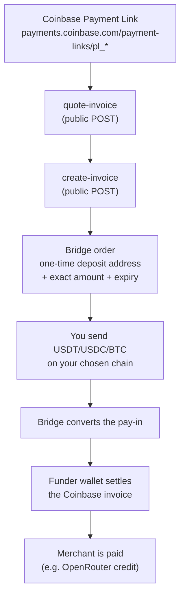

# rozo-checkout

[English](README.md) | [简体中文](README.zh.md) | **日本語** | [Español](README.es.md)

**OpenRouter の Coinbase 決済リンク (Payment Link)** を、そのリンクが直接受け取れない
通貨で支払うためのものです — Lightning 経由の BTC、あるいは Solana、BNB Chain、Ethereum、
Polygon、Base、Stellar 上の USDT/USDC が使えます。

Coinbase の決済リンクは Base 上の USDC しか受け付けません。このリポジトリはエージェント
スキル (agent skill) であり、その裏で動く Node スクリプトも含みます。上記のいずれの通貨も
ブリッジ (bridge) を通して中継します。実際に保有している通貨向けの使い捨て入金アドレス
(deposit address) が発行され、入金が着金すると資金提供ウォレット (funder wallet) が
あなたに代わって Coinbase のインボイスを決済します。

インボイス自体には**割引はありません**。`callerPays` はインボイス金額と等しくなります。
一方、あなたが送金する**入金額**はそれとは別の数値であり、通常はより大きくなります。
インボイス金額を Base USDC で届けるために必要なブリッジ手数料とソースチェーン手数料が
含まれるためです。バックエンドが返した `deposit.amount` を必ずそのまま送金してください。
インボイス金額と等しいと決して思い込まないでください。

- `SKILL.md` — エージェント向けの指示書（Claude Code のスキル形式）。
- `scripts/` — Node による実装。`src/` がソースで、`dist/` には素の `node` で実行できる
  自己完結型のバンドルが入っています。
- `test/` — 資金処理と安全性ロジックのオフライン単体テスト。
- `PLAN.md` — 実装が従っている設計ドキュメント。

利用にあたって、アカウント、API キー、運営者との何らかの関係は**一切必要ありません**。
呼び出す全エンドポイントは公開かつ鍵不要です。

## 仕組み



mermaid を表示できない端末向けに、同じ内容を ASCII で示します。

```
  Coinbase Payment Link (pl_* / paymentSession_*)
            |
            v
  [ quote-invoice ]  ->  merchant, amount, expiry, short-lived quote receipt
            |
            v
  [ create-invoice ] ->  bridge order:  rozoPaymentId + deposit address
            |                            + exact amount + order expiry
            v
  you send USDT / USDC / BTC on your chain  ------> deposit address
            |
            v
  bridge converts the pay-in  ------>  funder wallet pays the Coinbase invoice
            |
            v
  merchant credited; poll until the state is `settled`
```

全体を通して 3 つの識別子が登場します。これらは決して互換ではありません。

| 識別子 | 内容 |
|---|---|
| `linkId` | Coinbase 側の id: `pl_*`（決済リンク）または `paymentSession_*`（v3 セッション） |
| `rozoPaymentId` | ブリッジ注文の UUID — 入金詳細とステータスの照会にはこれを使います |
| `paymentLink` | ブリッジ注文用のホスト型決済ページ URL（人手によるフォールバック） |

## 対応するソース

| チェーン | チェーン id | トークン | 備考 |
|---|---|---|---|
| Ethereum | `1` | USDC, USDT | 小数点以下 6 桁 |
| BNB Chain | `56` | USDC, USDT | **小数点以下 18 桁** — 10^12 のずれによるバグの典型的な原因 |
| Polygon | `137` | USDC, USDT | 小数点以下 6 桁 |
| Base | `8453` | USDC | 小数点以下 6 桁 |
| Solana | `900` | USDC, USDT | 小数点以下 6 桁。SPL で、メモ (memo) が必要な場合あり。ネイティブの SOL は**非対応** |
| Stellar | `1500` | USDC | 小数点以下 7 桁。メモが必須 |
| Bitcoin Lightning | `lightning` | BTC | 金額は整数の **satoshi**。BOLT11 インボイス (BOLT11) で支払います |

ネイティブのガス通貨（SOL、BNB、ETH、MATIC）およびオンチェーンの BTC は受け付けません。

## クイックスタート

### 1. curl で公開エンドポイントを試す

`pl_01YOURLINKID` を実際の Coinbase 決済リンクに置き換えてください。以下のどれにも認証
ヘッダーは不要です。

```bash
MPP="https://apiserver.mpprouter.dev/v1/services/rozo-agent-api"
INTENTS="https://intentapiv4.rozo.ai/functions/v1/payment-api"
LINK="https://payments.coinbase.com/payment-links/pl_01YOURLINKID"

# 見積もりを取得: 加盟店、金額、有効期限、約 60 秒有効な quoteReceipt。
curl -s -X POST "$MPP/quote-invoice" \
  -H 'content-type: application/json' \
  -d "{\"url\":\"$LINK\"}"

# 例として Solana 上の USDT でブリッジ注文を作成します。
# 注文を作るだけで資金は動きません。入金のない注文はそのまま期限切れになります。
curl -s -X POST "$MPP/create-invoice" \
  -H 'content-type: application/json' \
  -d "{\"url\":\"$LINK\",\"source\":{\"chainId\":\"900\",\"tokenSymbol\":\"USDT\"}}"

# 入金手順（これが正）。上で得た rozoPaymentId を使います。
curl -s "$INTENTS/payments/<rozoPaymentId>"

# 履行ステータス。Coinbase の linkId を使います。
curl -s "$MPP/invoice-status?payment_id=pl_01YOURLINKID"
```

`create-invoice` は IP 単位でレート制限されています（およそ 30 回/時）。読み取り系
エンドポイントには制限はありません。

### 2. スクリプトを使う

各スクリプトは標準出力にちょうど 1 個の JSON オブジェクトを出力します。終了コードは
`0` が成功、`1` が拒否/失敗（`error.code` を参照）、`2` が使い方の誤り、`3` が送信済みだが
未確認です。

```bash
# ステップ 1 — 読み取り専用の見積もり。費用はかかりません
node scripts/dist/quote.js --url "$LINK"

# ステップ 2 — 注文を作成します（資金は動きません。入金のない注文は期限切れになります）。
#             この段階では完全な入金アドレスは伏せられます。確認用のマスクされた
#             サマリーと `depositWithheld: true` が返ります。
node scripts/dist/create-order.js --url "$LINK" --chain 900 --token USDT

# ステップ 3 — 金額、チェーン、マスクされたアドレス、メモの要否、有効期限を確認します。
#             支払うと決めたときにだけ、同じコマンドを --confirm 付きで実行し直して
#             ください。これで完全な deposit ブロックが開示され、送金スクリプトが要求する
#             確認記録が残ります。
node scripts/dist/create-order.js --url "$LINK" --chain 900 --token USDT --confirm

# ステップ 4a — モード A: deposit ブロックの内容を自分のウォレットから支払い、
#              その後の決済完了を監視します
node scripts/dist/status.js --rozo-payment-id <uuid> --watch --timeout 600

# ステップ 4b — モード B: スクリプトにホットウォレットから支払わせます。--dry-run では
#              署名は一切行いません。実際に送金するにはさらに --send が必要です。
ROZO_CHECKOUT_SOL_KEY=<base58 secret key> \
  node scripts/dist/send-sol.js --rozo-payment-id <uuid> --dry-run
```

`scripts/dist/*.js` は自己完結型のバンドルです。呼び出し側で `npm install` を実行する
必要はありません。

## ビルドとテスト

```bash
npm install     # 再ビルドまたはテスト実行のときだけ必要です
npm run build   # esbuild -> scripts/dist/*.js (node18 ターゲット) + blacklist.json
npm test        # node:test、完全オフライン
npm run check   # ビルド + テスト
```

テストは**ネットワーク通信を一切行いません**。バックエンドのレスポンスはすべて
`test/fixtures/` 内のフィクスチャです。テスト対象は、最小単位への金額変換（小数点以下
6/18 桁と Lightning の satoshi）、有効期限マージンの計算、危殆化アドレスの正規化と
フェイルクローズ動作、注文再利用の判定、作成後の検証比較器、入金手順の完全性ルールです。

2 つのグループは関数呼び出しではなく実際の子プロセスを起動します。単一プロセスの
テストでは検証できないものを対象とするためです。並行性スイートは複数プロセスを競合させて
1 つの注文の獲得（勝てるのはちょうど 1 つだけ）とセッション上限の使い切りを検証し、
エントリーポイントスイートはビルド済みの送金スクリプトを実行して、`--send` がない場合、
確認がない場合、既に他が獲得済みの場合に拒否することを証明します。

## 安全性の設計

このリポジトリで興味深いのは、何をするかではなく、何を頑として拒否するかです。

- **二段階確認の強制。** `create-order.js` は、`--confirm` 付きで再実行されるまで完全な
  入金アドレス、メモ、BOLT11 を伏せます。再実行時には、その手順そのものの sha256 に
  紐づいた確認記録が保存されます。送金スクリプトは、`--send` と、ダイジェストが現在の
  データと一致し続けている確認記録の両方がなければ実行を拒否します。したがって、誤った
  実行でも、すり替えられた入金アドレスでも、資金は動きません。
- **常にインボイス全額。** `callerPays` はインボイス金額と等しくなければならず、
  `discount` は `"0"` でなければなりません。それ以外は `NO_DISCOUNT_VIOLATION` で中断します。
  セキュリティ上重要なフィールド（`linkId`、`merchant`、`original`、`callerPays`、
  エコーバックされた source）は、値が一致しているだけでなく存在していることも必要です。
  欠落しているフィールドは乖離 (drift) とみなします。
- **再利用ガード。** すでに期限切れでない注文があるリンクに対して注文を作成すると、その
  既存の注文が返されます。たとえその注文がすでに入金済みであってもです。そのため実行の
  たびに、現在の注文が未入金であること（`payment_unpaid`、tx ハッシュなし、受領金額なし、
  確認なし）と、呼び出し側が選んだチェーンおよびトークンと一致することを必須としています。
  そうでない場合は `ORDER_ALREADY_FUNDED` または `REUSED_SOURCE_MISMATCH` になります。
- **入金検知ルール、フェイルクローズ。** いったん何らかの入金が存在すると、このツールは
  単純な失敗として報告することも、再度の支払いを勧めることも、新しい注文で再試行することも
  ありません。`amountReceived` が null ではないが読み取れない場合は、資金がないのではなく
  資金があるものとして扱います。バックエンドが読み取れない場合は `awaiting_deposit` では
  なく `unknown` を報告します。
- **完全な入金手順。** 金額がゼロ、負数、あるいは解析不能な場合は中断します。Lightning では
  BOLT11 が必須です（アドレスは空で、`source.lnInvoice` に入って届きます）。Stellar では
  メモが必須で、メモの欠落は「メモ不要」と表示されることは決してなく、必ず強制中断となります。
- **有効期限マージン。** 注文の有効期限と Coinbase の有効期限のうち早いほうが、チェーン
  ごとのマージン（EVM と Stellar は 10 分、Solana は 5 分）を超えて先でない限り、支払いは
  拒否されます。Lightning ではさらに BOLT11 の有効期間が最低 10 分残っている必要があります。
  期限が欠落している、または解析できない場合は中断します。
- **支払い可能性の再検証。** quote receipt があると注文作成時のライブ Coinbase チェックが
  スキップされ、またリンクはいつ他人に消費されてもおかしくありません。そのため、入金
  アドレスを表示する直前に支払い可能性を再確認し、さらに RPC の準備がすべて済んだ後、
  ブロードキャスト直前の最終ステップとしてもう一度確認します。Coinbase の状態が不完全な
  場合は、支払い可能ではなく「支払い可能だと証明できない」として扱います。
- **危殆化アドレスリスト、フェイルクローズ。** `scripts/src/lib/blacklist.json` には、
  出所ヘッダーとアドレス全体の sha256 を伴うベンダリング済みのリストが入っています。この
  ダイジェストが証明するのは、このベンダリングされたコピーが同期日以降編集されていない
  ことだけであり、上流ソースによる署名ではありません。入金アドレスと送金元ウォレットの
  両方がチェックされます。ファイルが存在しない、形式が不正、空、あるいはダイジェストが
  一致しない場合は、未チェックのまま処理を続けるのではなく、すべての送金を拒否します。
- **プロセスをまたいだ一度きりの送金。** 注文の状態は
  `$HOME/.rozo-checkout/state/<uuid>.json` に置かれ、アトミックに書き込まれます
  （一時ファイル、fsync、rename）。状態ファイルの read-modify-write は、獲得処理、支出上限、
  注文レコード、確認記録のいずれも、単一の排他ロックファイルの内側で実行されます。
  そのため、同時に起動した 2 つの実行が両方とも自分が先だと判断することも、互いの送金
  記録を上書きすることもありません。送金はブロードキャストの*前*に獲得されるため、
  曖昧な RPC エラーが二重送金になることは決してありません。トランザクションは
  ブロードキャスト前に署名されるのでハッシュは事前に判明しており、結果が曖昧な場合、
  スクリプトは再ブロードキャストせずにそのトランザクションそのものを照会します。
- **ホットウォレットの制御。** 鍵は環境変数からのみ取得され
  （`ROZO_CHECKOUT_EVM_KEY`、`ROZO_CHECKOUT_SOL_KEY`）、決して出力されず、コマンドライン
  から渡すこともできません。ライブラリと RPC のエラーは、認証情報を含むプロバイダー URL、
  bearer トークン、鍵のような形の文字列も含めて、表示前に伏字化されます。作業ディレクトリの
  `.env`/`.env.*` のいずれかが git で追跡されている場合、スクリプトは実行を拒否します。
  git が未追跡であることを証明できない場合も同様に拒否します。署名の前に、RPC の
  チェーン id（Solana ではジェネシスハッシュ）とトークンのオンチェーン小数桁数が検証されます。
  上限はトランザクションごとに $100、セッション累計で $200 です。
- **アドレスのマスキング。** 説明文では `first6...last4` の形で表示します。完全な入金
  アドレス、メモ、BOLT11 文字列は機械可読な `deposit` オブジェクトの中にのみ現れるので、
  コピー＆ペーストできる形を保ったまま、ログのあちこちに散らばることがありません。

## ライセンス

MIT.
