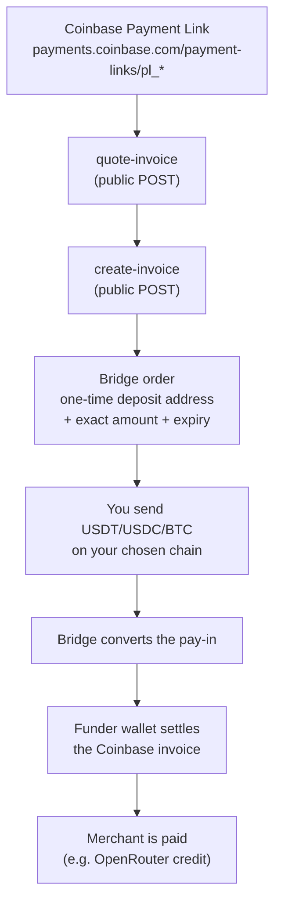

# rozo-checkout

Pay an **OpenRouter Coinbase Payment Link** with a coin that link cannot take
directly — BTC over Lightning, or USDT/USDC on Solana, BNB Chain, Ethereum,
Polygon, Base or Stellar.

A Coinbase Payment Link only accepts USDC on Base. This repo is an agent skill
(plus the Node scripts behind it) that routes any of the coins above through a
bridge: you get a one-time deposit address for the coin you actually hold, and
once your deposit lands a funder wallet settles the Coinbase invoice on your
behalf. You pay the **full invoice amount** — there is no discount and no
surcharge on this route.

- `SKILL.md` — the agent-facing instructions (Claude Code skill format).
- `scripts/` — the Node implementation; `src/` is the source, `dist/` holds
  self-contained bundles you can run with plain `node`.
- `test/` — offline unit tests for the money-handling and safety logic.
- `PLAN.md` — the design document the implementation follows.

You do **not** need an account, an API key, or any relationship with the
operator to use this. Every endpoint it calls is public and keyless.

## How it works



The same thing as ASCII, for terminals without mermaid:

```
  Coinbase Payment Link (pl_* / paymentSession_*)
            |
            v
  [ quote-invoice ]  ->  merchant, amount, expiry, short-lived quote receipt
            |
            v
  [ create-invoice ] ->  bridge order:  rozoPaymentId + deposit address
            |                            + exact amount + order expiry
            v
  you send USDT / USDC / BTC on your chain  ------> deposit address
            |
            v
  bridge converts the pay-in  ------>  funder wallet pays the Coinbase invoice
            |
            v
  merchant credited; poll until the state is `settled`
```

Three identifiers appear throughout and are never interchangeable:

| Identifier | What it is |
|---|---|
| `linkId` | the Coinbase id: `pl_*` (Payment Link) or `paymentSession_*` (v3 session) |
| `rozoPaymentId` | the bridge order's UUID — use this for deposit detail and status |
| `paymentLink` | a hosted pay page URL for the bridge order (human fallback) |

## Supported sources

| Chain | Chain id | Tokens | Notes |
|---|---|---|---|
| Ethereum | `1` | USDC, USDT | 6 decimals |
| BNB Chain | `56` | USDC, USDT | **18 decimals** — the usual source of off-by-10^12 bugs |
| Polygon | `137` | USDC, USDT | 6 decimals |
| Base | `8453` | USDC | 6 decimals |
| Solana | `900` | USDC, USDT | 6 decimals; SPL, may require a memo. Native SOL is **not** supported |
| Stellar | `1500` | USDC | 7 decimals; requires the memo |
| Bitcoin Lightning | `lightning` | BTC | amounts are integer **satoshis**, paid via a BOLT11 invoice |

Native gas coins (SOL, BNB, ETH, MATIC) and on-chain BTC are not accepted.

## Quickstart

### 1. Try the public endpoints with curl

Replace `pl_01YOURLINKID` with a real Coinbase Payment Link. No auth header is
needed anywhere below.

```bash
MPP="https://apiserver.mpprouter.dev/v1/services/rozo-agent-api"
INTENTS="https://intentapiv4.rozo.ai/functions/v1/payment-api"
LINK="https://payments.coinbase.com/payment-links/pl_01YOURLINKID"

# Quote it: merchant, amount, expiry, and a ~60-second quoteReceipt.
curl -s -X POST "$MPP/quote-invoice" \
  -H 'content-type: application/json' \
  -d "{\"url\":\"$LINK\"}"

# Create a bridge order for, say, USDT on Solana.
# This creates an order but moves no money; an unfunded order simply expires.
curl -s -X POST "$MPP/create-invoice" \
  -H 'content-type: application/json' \
  -d "{\"url\":\"$LINK\",\"source\":{\"chainId\":\"900\",\"tokenSymbol\":\"USDT\"}}"

# Deposit instructions (authoritative), using the rozoPaymentId from above.
curl -s "$INTENTS/payments/<rozoPaymentId>"

# Fulfilment status, using the Coinbase linkId.
curl -s "$MPP/invoice-status?payment_id=pl_01YOURLINKID"
```

`create-invoice` is rate-limited per IP (about 30/hour); the read endpoints are
not.

### 2. Use the scripts

Each script prints exactly one JSON object on stdout. Exit `0` success, `1`
refused/failed (read `error.code`), `2` usage, `3` submitted but unconfirmed.

```bash
# Step 1 — read-only quote, costs nothing
node scripts/dist/quote.js --url "$LINK"

# Step 2 — create the order (no money moves; unfunded orders expire)
node scripts/dist/create-order.js --url "$LINK" --chain 900 --token USDT

# Step 3a — Mode A: pay the printed deposit address from your own wallet,
#           then watch it settle
node scripts/dist/status.js --rozo-payment-id <uuid> --watch --timeout 600

# Step 3b — Mode B: let the script pay from a hot wallet (opt-in)
ROZO_CHECKOUT_SOL_KEY=<base58 secret key> \
  node scripts/dist/send-sol.js --rozo-payment-id <uuid> --dry-run
```

`scripts/dist/*.js` are self-contained bundles — no `npm install` is needed at
the call site.

## Build and test

```bash
npm install     # only needed to rebuild or to run the tests
npm run build   # esbuild -> scripts/dist/*.js (node18 target) + blacklist.json
npm test        # node:test, fully offline
npm run check   # build + test
```

Tests make **no network calls**; every backend response is a fixture in
`test/fixtures/`. They cover the atomic-amount conversion (6/18 decimals and
Lightning satoshis), the expiry-margin arithmetic, compromised-address
normalization and fail-closed behaviour, the order reuse decision, and the
post-create verification comparator.

## Safety design

The interesting part of this repo is what it refuses to do.

- **Full invoice, always.** `callerPays` must equal the invoice amount and
  `discount` must be `"0"`; anything else aborts with `NO_DISCOUNT_VIOLATION`.
- **Reuse guard.** Creating an order for a link that already has an unexpired
  order returns that existing order — even if it has already been funded. So on
  every run the live order is required to be unpaid (`payment_unpaid`, no tx
  hash, no amount received, no confirmation) and to match the chain and token
  the caller chose. Otherwise: `ORDER_ALREADY_FUNDED` or
  `REUSED_SOURCE_MISMATCH`.
- **Money-detected rule.** Once any pay-in exists, the tooling never reports a
  plain failure, never advises paying again, and never retries into a new
  order. It preserves every identifier and escalates.
- **Expiry margins.** Payment is refused unless the earlier of the order expiry
  and the Coinbase expiry is more than a per-chain margin away (10 min EVM and
  Stellar, 5 min Solana). Lightning additionally requires at least 10 minutes
  of BOLT11 validity. A missing or unparsable deadline aborts.
- **Payability revalidation.** A quote receipt makes order creation skip the
  live Coinbase check, and the link can be consumed by someone else at any
  moment — so payability is re-checked immediately before the deposit address
  is shown and again immediately before signing.
- **Compromised-address list, fail closed.** `scripts/src/lib/blacklist.json`
  carries a vendored list with a provenance header and a sha256 over the
  addresses. Both the deposit address and the sending wallet are checked. If
  the file is missing, malformed, empty, or its digest does not match, every
  send is refused rather than proceeding unchecked.
- **Send-once.** Order state lives in `$HOME/.rozo-checkout/state/<uuid>.json`,
  written atomically (temp file, fsync, rename). A send is claimed there
  *before* broadcasting, so an ambiguous RPC error can never become a second
  transfer. On an ambiguous result the scripts inspect chain state instead of
  rebroadcasting.
- **Hot-wallet controls.** Keys come from the environment only
  (`ROZO_CHECKOUT_EVM_KEY`, `ROZO_CHECKOUT_SOL_KEY`), are never printed and
  never accepted on the command line; library and RPC errors are redacted
  before display. The RPC's chain id (or Solana genesis hash) and the token's
  on-chain decimals are verified before signing. Caps: $100 per transaction,
  $200 cumulative per session.
- **Address masking.** Prose shows `first6...last4`. The full deposit address,
  memo and BOLT11 string appear only inside the machine-readable `deposit`
  object, so they stay copy-pastable without being scattered through logs.

## License

MIT.
