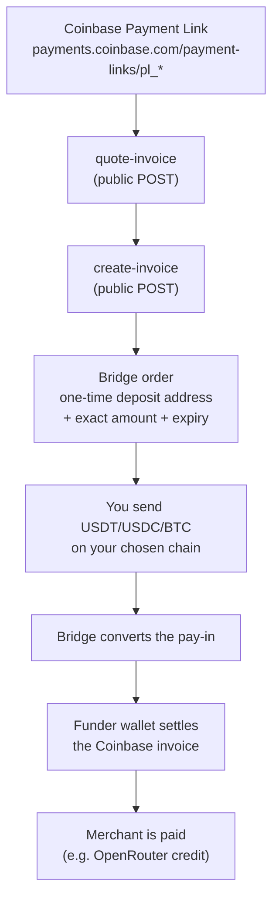

# rozo-checkout

[English](README.md) | **简体中文** | [日本語](README.ja.md) | [Español](README.es.md)

用一种 **OpenRouter Coinbase 收款链接 (Payment Link)** 本身无法直接接受的币种去付款 —— 走闪电网络的 BTC，或者 Solana、BNB Chain、Ethereum、Polygon、Base、Stellar 上的 USDT/USDC。

Coinbase 收款链接只接受 Base 上的 USDC。本仓库是一个 agent skill（以及背后的 Node 脚本），它把上面这些币种通过一座桥 (bridge) 路由过去：你会拿到一个针对你实际持有的币种的一次性充值地址 (deposit address)，等你的充值到账后，一个出资钱包会代你结清这张 Coinbase 账单。

在账单本身上**没有折扣**：`callerPays` 等于账单金额。你要发送的**充值金额**是另一个数字，而且通常更大 —— 它包含了把账单金额以 Base USDC 形式送达所需的跨桥费用和源链费用。永远严格按后端返回的 `deposit.amount` 发送；绝不要假定它等于账单金额。

- `SKILL.md` —— 面向 agent 的指令（Claude Code skill 格式）。
- `scripts/` —— Node 实现；`src/` 是源码，`dist/` 存放可以用纯 `node` 直接运行的自包含打包产物。
- `test/` —— 针对资金处理与安全逻辑的离线单元测试。
- `PLAN.md` —— 实现所遵循的设计文档。

使用它**不**需要账号、API key，也不需要与运营方有任何关系。它调用的每一个端点都是公开且无需密钥的。

## 工作原理



同样的流程用 ASCII 表示，供不支持 mermaid 的终端查看：

```
  Coinbase Payment Link (pl_* / paymentSession_*)
            |
            v
  [ quote-invoice ]  ->  merchant, amount, expiry, short-lived quote receipt
            |
            v
  [ create-invoice ] ->  bridge order:  rozoPaymentId + deposit address
            |                            + exact amount + order expiry
            v
  you send USDT / USDC / BTC on your chain  ------> deposit address
            |
            v
  bridge converts the pay-in  ------>  funder wallet pays the Coinbase invoice
            |
            v
  merchant credited; poll until the state is `settled`
```

全文出现三个标识符，它们彼此绝不可混用：

| 标识符 | 它是什么 |
|---|---|
| `linkId` | Coinbase 的 id：`pl_*`（收款链接）或 `paymentSession_*`（v3 会话） |
| `rozoPaymentId` | 桥订单的 UUID —— 查充值详情和状态用它 |
| `paymentLink` | 该桥订单对应的托管支付页面 URL（供人工兜底使用） |

## 支持的来源

| 链 | 链 id | 代币 | 备注 |
|---|---|---|---|
| Ethereum | `1` | USDC, USDT | 6 位小数 |
| BNB Chain | `56` | USDC, USDT | **18 位小数** —— 差 10^12 这类 bug 的常见来源 |
| Polygon | `137` | USDC, USDT | 6 位小数 |
| Base | `8453` | USDC | 6 位小数 |
| Solana | `900` | USDC, USDT | 6 位小数；SPL，可能需要 memo。原生 SOL **不**支持 |
| Stellar | `1500` | USDC | 7 位小数；必须带 memo |
| Bitcoin Lightning | `lightning` | BTC | 金额是整数**聪 (satoshis)**，通过闪电网络发票 (BOLT11) 支付 |

原生 gas 币（SOL、BNB、ETH、MATIC）以及链上 BTC 均不接受。

## 快速上手

### 1. 用 curl 试试公开端点

把 `pl_01YOURLINKID` 换成一个真实的 Coinbase 收款链接。下面所有请求都不需要任何 auth header。

```bash
MPP="https://apiserver.mpprouter.dev/v1/services/rozo-agent-api"
INTENTS="https://intentapiv4.rozo.ai/functions/v1/payment-api"
LINK="https://payments.coinbase.com/payment-links/pl_01YOURLINKID"

# 报价：返回商家、金额、过期时间，以及一个约 60 秒有效的 quoteReceipt。
curl -s -X POST "$MPP/quote-invoice" \
  -H 'content-type: application/json' \
  -d "{\"url\":\"$LINK\"}"

# 创建一个桥订单，比如用 Solana 上的 USDT。
# 这一步只创建订单，不动任何资金；未付款的订单会自动过期。
curl -s -X POST "$MPP/create-invoice" \
  -H 'content-type: application/json' \
  -d "{\"url\":\"$LINK\",\"source\":{\"chainId\":\"900\",\"tokenSymbol\":\"USDT\"}}"

# 充值指令（以此为准），用上一步拿到的 rozoPaymentId。
curl -s "$INTENTS/payments/<rozoPaymentId>"

# 履约状态，用 Coinbase 的 linkId 查询。
curl -s "$MPP/invoice-status?payment_id=pl_01YOURLINKID"
```

`create-invoice` 按 IP 限流（约每小时 30 次）；读取类端点不限流。

### 2. 使用脚本

每个脚本在 stdout 上只打印一个 JSON 对象。退出码 `0` 表示成功，`1` 表示被拒绝/失败（读 `error.code`），`2` 表示用法错误，`3` 表示已提交但未确认。

```bash
# 第 1 步 —— 只读报价，不产生任何费用
node scripts/dist/quote.js --url "$LINK"

# 第 2 步 —— 创建订单（不动资金；未付款的订单会过期）。
#            此阶段完整充值地址会被扣留：你只拿到打码后的摘要用于核对，
#            以及 `depositWithheld: true`。
node scripts/dist/create-order.js --url "$LINK" --chain 900 --token USDT

# 第 3 步 —— 核对金额、链、打码地址、是否需要 memo 以及过期时间。
#            只有在你决定付款之后，才用 --confirm 重新执行同一条命令。
#            这会释放完整的充值信息块，并记录下发送脚本所需的确认。
node scripts/dist/create-order.js --url "$LINK" --chain 900 --token USDT --confirm

# 第 4a 步 —— 模式 A：用你自己的钱包按充值信息块付款，
#             然后观察它结清
node scripts/dist/status.js --rozo-payment-id <uuid> --watch --timeout 600

# 第 4b 步 —— 模式 B：让脚本从热钱包付款。--dry-run 不会签任何名；
#             真正发送还额外需要 --send。
ROZO_CHECKOUT_SOL_KEY=<base58 secret key> \
  node scripts/dist/send-sol.js --rozo-payment-id <uuid> --dry-run
```

`scripts/dist/*.js` 是自包含的打包产物 —— 在调用现场无需 `npm install`。

## 构建与测试

```bash
npm install     # 只有重新构建或跑测试时才需要
npm run build   # esbuild -> scripts/dist/*.js（node18 目标）+ blacklist.json
npm test        # node:test，完全离线
npm run check   # 构建 + 测试
```

测试**不发起任何网络调用**；每一个后端响应都是 `test/fixtures/` 里的 fixture。它们覆盖了原子金额换算（6/18 位小数与闪电网络的聪）、过期余量的算术、被盗地址归一化与 fail-closed 行为、订单复用决策、创建后的校验比对器，以及充值指令完整性规则。

有两组测试会真正 spawn 子进程而不是直接调用函数，因为它们测的是单进程测试测不了的东西：并发测试组会让多个进程去抢同一个订单（只允许恰好一个赢）并把会话额度耗尽；入口点测试组会运行构建好的发送脚本，证明它们在缺少 `--send` 时、缺少确认时、以及已被先前的 claim 占用之后都会拒绝执行。

## 安全设计

这个仓库真正有意思的地方，在于它拒绝去做哪些事。

- **两阶段确认，强制执行。** `create-order.js` 会扣留完整的充值地址、memo 和 BOLT11，直到用 `--confirm` 重新执行；此时会记录一条确认，并绑定到这份确切指令的 sha256 上。发送脚本在同时满足 `--send` 和一条摘要仍与实时数据匹配的确认之前，一律拒绝执行 —— 所以无论是误触发调用，还是被掉包的充值地址，都无法动用资金。
- **足额付款，永远如此。** `callerPays` 必须等于账单金额，`discount` 必须是 `"0"`；任何其他情况都以 `NO_DISCOUNT_VIOLATION` 中止。安全攸关的字段（`linkId`、`merchant`、`original`、`callerPays`，以及回显的 source）不仅要相等，还必须存在 —— 字段缺失即视为漂移。
- **复用防护。** 为一个已经存在未过期订单的链接再次创建订单，会返回那个已有订单 —— 哪怕它已经被付过款。因此每次运行都要求实时订单处于未付款状态（`payment_unpaid`，没有 tx hash、没有收到金额、没有确认），并且与调用方选择的链和代币一致。否则报：`ORDER_ALREADY_FUNDED` 或 `REUSED_SOURCE_MISMATCH`。
- **一旦检测到资金即 fail closed。** 只要存在任何入账，工具就绝不报告为一个普通失败，绝不建议再付一次，也绝不重试去开一个新订单。一个非 null 但无法解析的 `amountReceived` 算作"有钱"，而不是"没钱"。后端不可读时报告 `unknown`，绝不报 `awaiting_deposit`。
- **完整的充值指令。** 金额为零、为负或无法解析都会中止。闪电网络必须有 BOLT11（它随 `source.lnInvoice` 返回，同时地址为空）。Stellar 必须有它的 memo —— memo 缺失是硬性中止，绝不会被渲染成"无需 memo"。
- **过期余量。** 取订单过期时间与 Coinbase 过期时间中较早的那个，除非它距现在超过按链设定的余量，否则拒绝付款（EVM 与 Stellar 为 10 分钟，Solana 为 5 分钟）。闪电网络还额外要求 BOLT11 至少还有 10 分钟有效期。截止时间缺失或无法解析都会中止。
- **可支付性复检。** 有了 quote receipt，创建订单时会跳过实时的 Coinbase 检查，而该链接随时可能被别人消费掉 —— 所以在展示充值地址之前会立刻重新检查一次可支付性，并在完成全部 RPC 准备工作之后、广播之前的最后一刻再检查一次。Coinbase 状态不完整时按"无法证明可支付"处理，而不是按可支付处理。
- **被盗地址清单，fail closed。** `scripts/src/lib/blacklist.json` 内置了一份 vendored 清单，带有来源出处头部以及对这些地址的 sha256。该摘要只能证明这份 vendored 副本自同步日期以来未被改动，它并不是上游来源的签名。充值地址和发送钱包都会被检查。如果该文件缺失、格式损坏、为空，或摘要对不上，那么所有发送都会被拒绝，而不是跳过检查继续执行。
- **只发一次，跨进程有效。** 订单状态存放在 `$HOME/.rozo-checkout/state/<uuid>.json`，以原子方式写入（临时文件、fsync、rename）。对状态文件的每一次读-改-写 —— claim、花费额度、订单记录和确认 —— 都在同一把独占 lockfile 内进行，因此两个并发调用既不会都认为自己是第一个，也不会互相覆盖对方的发送记录。发送会在广播*之前*被 claim，所以一个语义不明的 RPC 错误永远不会变成第二次转账。交易在广播前就已签名，因此 hash 是提前已知的；遇到结果不明确时，脚本会去查这笔确切的交易，而不是重新广播。
- **热钱包管控。** 私钥只从环境变量读取（`ROZO_CHECKOUT_EVM_KEY`、`ROZO_CHECKOUT_SOL_KEY`），永不打印，也绝不接受从命令行传入；库和 RPC 的错误在展示前会被脱敏，包括带凭据的 provider URL、bearer token 和形似密钥的字符串。当工作目录下任何 `.env`/`.env.*` 被 git 跟踪时，脚本拒绝运行；当 git 无法证明它未被跟踪时，同样坚决拒绝。签名前会校验 RPC 的链 id（Solana 则是 genesis hash）以及代币的链上小数位。额度上限：单笔 $100，单会话累计 $200。
- **地址打码。** 正文中显示为 `first6...last4`。完整的充值地址、memo 和 BOLT11 字符串只出现在机器可读的 `deposit` 对象里，这样它们既保持可复制粘贴，又不会散落在各处日志中。

## 许可证

MIT。
