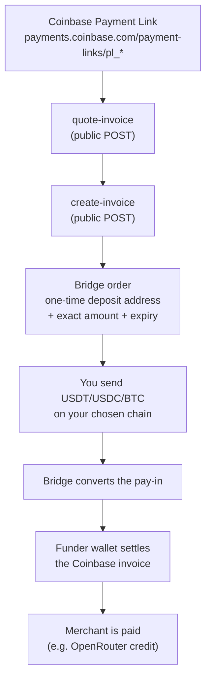

# How it works

[← back to the README](../README.md) · [Quick start](QUICKSTART.md) · [Safety design](safety.md)



The same thing as ASCII, for terminals without mermaid:

```
  Coinbase Payment Link (pl_* / paymentSession_*)
            |
            v
  [ quote-invoice ]  ->  merchant, amount, expiry, short-lived quote receipt
            |
            v
  [ create-invoice ] ->  bridge order:  rozoPaymentId + deposit address
            |                            + exact amount + order expiry
            v
  you send USDT / USDC / BTC on your chain  ------> deposit address
            |
            v
  bridge converts the pay-in  ------>  funder wallet pays the Coinbase invoice
            |
            v
  merchant credited; poll until the state is `settled`
```

Three identifiers appear throughout and are never interchangeable:

| Identifier | What it is |
|---|---|
| `linkId` | the Coinbase id: `pl_*` (Payment Link) or `paymentSession_*` (v3 session) |
| `rozoPaymentId` | the bridge order's UUID — use this for deposit detail and status |
| `paymentLink` | a hosted pay page URL for the bridge order (human fallback) |
